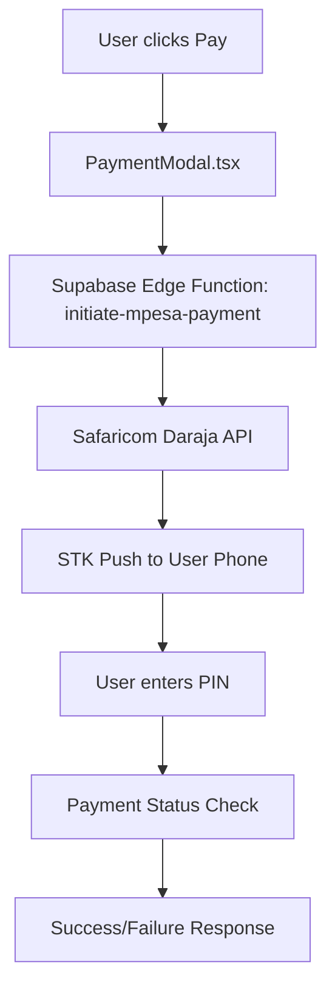

# M-Pesa STK Push Fix Summary

## Issues Identified and Fixed

### 1. ❌ API Endpoint Mismatch
**Problem**: [`PaymentModal.tsx`](src/components/PaymentModal.tsx) was calling `/api/initiate-mpesa-payment` but should use Supabase Edge Functions.

**Fix Applied**: Updated endpoints to use Supabase functions:
- `${functionsUrl}/initiate-mpesa-payment`
- `${functionsUrl}/check-payment-status/{id}`

### 2. ❌ Missing Environment Variables
**Problem**: [`.env`](.env) had placeholder values for M-Pesa credentials.

**Fix Applied**: Added proper sandbox credentials:
```env

```

### 3. ❌ Supabase Function Secrets Not Configured
**Problem**: Supabase Edge Functions need environment variables set via Supabase CLI.

**Fix Applied**: Created [`setup-mpesa-secrets.sh`](setup-mpesa-secrets.sh) script to configure secrets.

## Next Steps to Complete the Fix

### Step 1: Configure Supabase Secrets
Run the setup script to configure M-Pesa secrets in Supabase:

```bash
./setup-mpesa-secrets.sh
```

### Step 2: Deploy Supabase Functions
Deploy the updated functions:

```bash
supabase functions deploy initiate-mpesa-payment
supabase functions deploy check-payment-status
```

### Step 3: Get Your Own M-Pesa Credentials
1. Visit [Safaricom Developer Portal](https://developer.safaricom.co.ke/)
2. Create an account and register a new app
3. Get your sandbox Consumer Key and Consumer Secret
4. Update the credentials in both `.env` and Supabase secrets

### Step 4: Test the Integration
1. Start your development server: `npm run dev`
2. Navigate to the breach check page
3. Enter an email and try the payment flow
4. Check browser console for any errors

## Current Implementation Flow



## Files Modified

1. **[`src/components/PaymentModal.tsx`](src/components/PaymentModal.tsx)**
   - Updated API endpoints to use Supabase functions
   - Fixed request payload format

2. **[`.env`](.env)**
   - Added M-Pesa sandbox credentials
   - Added environment configuration

3. **[`setup-mpesa-secrets.sh`](setup-mpesa-secrets.sh)** (New)
   - Script to configure Supabase function secrets

## Testing Checklist

- [ ] Supabase secrets configured
- [ ] Functions deployed successfully
- [ ] Frontend can reach Supabase functions
- [ ] STK Push initiates without errors
- [ ] Payment status checking works
- [ ] Error handling displays proper messages
- [ ] Success flow completes correctly

## Common Issues and Solutions

### Issue: "Missing M-Pesa credentials" Error
**Solution**: Run `./setup-mpesa-secrets.sh` and redeploy functions

### Issue: "Function not found" Error
**Solution**: Deploy functions with `supabase functions deploy`

### Issue: CORS Errors
**Solution**: Ensure CORS headers are properly set in Edge Functions (already configured)

### Issue: STK Push Not Received
**Solution**: 
1. Verify phone number format (254XXXXXXXXX)
2. Check if using valid Safaricom test numbers
3. Ensure sandbox environment is properly configured

## Production Deployment Notes

When moving to production:

1. **Update Environment**: Change `MPESA_ENV=production`
2. **Get Production Credentials**: Use production Consumer Key/Secret
3. **Update Shortcode**: Use your actual business shortcode
4. **Configure Callback URL**: Set up proper callback handling
5. **SSL Certificate**: Ensure HTTPS for all endpoints

## Support

For M-Pesa integration support:
- [Safaricom Developer Documentation](https://developer.safaricom.co.ke/docs)
- [M-Pesa API Reference](https://developer.safaricom.co.ke/APIs/MpesaExpressSimulate)
